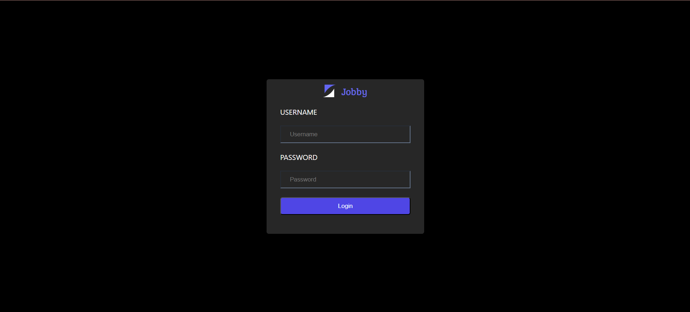
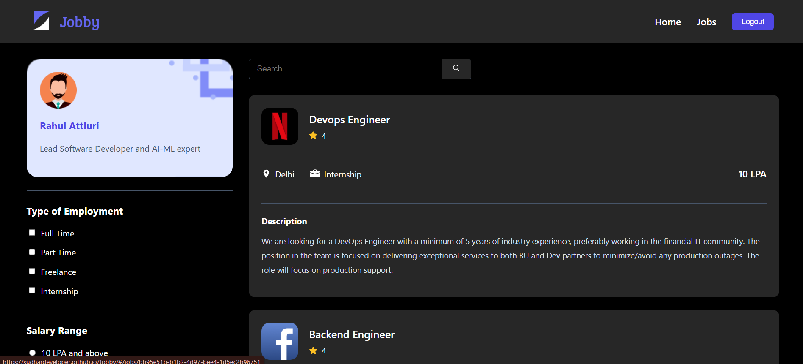
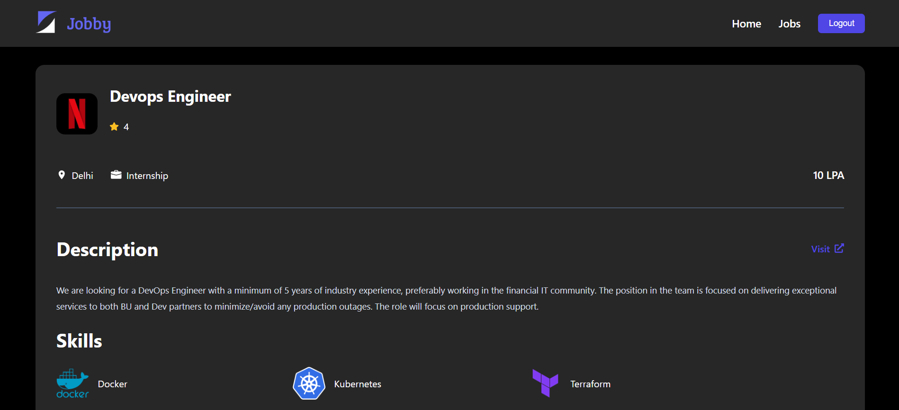

# 💼 Jobby App

A modern **React.js** job search application that enables users to browse job listings, search for jobs, apply filters, and explore detailed job information through a clean and responsive interface.

> ## 🔑 Demo Login Credentials
>
> **Username:** `rahul`  
> **Password:** `rahul@2021`
>
> **Username:** `raja`  
> **Password:** `raja@2021`
>
> **Username:** `praneetha`  
> **Password:** `praneetha@2021`

---

## 🚀 Live Demo

🔗 **https://sudhardeveloper.github.io/Jobby/**

---

## 📸 Screenshots

### Login Page


### Home Page


### Jobs Page


### Job Details Page


---

## ✨ Features

- 🔐 Secure JWT Authentication
- 🏠 Responsive Home Page
- 👤 User Profile Section
- 🔍 Search Jobs
- 💼 Filter Jobs by Employment Type
- 💰 Filter Jobs by Salary Range
- 📄 Detailed Job Information
- 🧠 Similar Jobs Recommendation
- 🌐 Visit Company Website
- ⚡ Loading Spinner
- 🔁 Retry on API Failure
- ❌ Custom 404 Page
- 📱 Fully Responsive Design

---

## 🛠️ Tech Stack

### Frontend
- React.js
- React Router DOM
- JavaScript (ES6)
- HTML5
- CSS3

### Packages Used
- react-router-dom
- js-cookie
- react-loader-spinner
- react-icons

---

## 📂 Project Structure

```text
src
│
├── Components
│   ├── Header
│   ├── Home
│   ├── Login
│   ├── Jobs
│   ├── JobItem
│   ├── JobItemDetails
│   ├── SimilarJobItem
│   ├── ProtectedRoute
│   └── NotFound
│
├── App.js
├── index.js
└── App.css
```

---

## 📌 Application Pages

### 🔐 Login
- User Authentication
- JWT Token Generation
- Protected Route Access

### 🏠 Home
- Landing Page
- Navigation to Jobs Page

### 💼 Jobs
- User Profile
- Search Jobs
- Employment Type Filters
- Salary Range Filters
- Job Listings

### 📄 Job Details
- Company Information
- Job Description
- Skills Required
- Life at Company
- Similar Jobs
- External Company Website Link

### ❌ Not Found
- Custom 404 Error Page

---

## 🔗 API Endpoints

```http
POST /login
GET /profile
GET /jobs
GET /jobs/:id
```

---

## ⚙️ Installation

### Clone the Repository

```bash
git clone https://github.com/SudharDeveloper/Jobby.git
```

### Navigate to the Project

```bash
cd Jobby
```

### Install Dependencies

```bash
npm install
```

### Start Development Server

```bash
npm start
```

Open your browser and visit:

```text
http://localhost:3000
```

---

## 📦 Production Build

```bash
npm run build
```

---

## 🚀 Deploy to GitHub Pages

```bash
npm run deploy
```

---

## 🎯 Future Improvements

- ❤️ Save/Bookmark Jobs
- 📄 Apply Job Feature
- 🌙 Dark Mode
- 📄 Pagination
- ↕️ Sorting Options
- 🕒 Recent Searches
- ⭐ Company Reviews
- 🤖 AI Job Recommendations

---

## 👨‍💻 Author

**Sudharsan V**

### GitHub
https://github.com/SudharDeveloper

### LinkedIn
https://www.linkedin.com/in/sudharsan-venkatesan-/

---

## 🤝 Contributing

Contributions, issues, and feature requests are welcome!

If you'd like to improve this project:

1. Fork the repository
2. Create your feature branch
3. Commit your changes
4. Push to the branch
5. Open a Pull Request

---

## ⭐ Show Your Support

If you found this project helpful, please consider giving it a ⭐ on GitHub.

It motivates me to build more open-source projects!

---

## 📄 License

This project is developed for educational and portfolio purposes.
